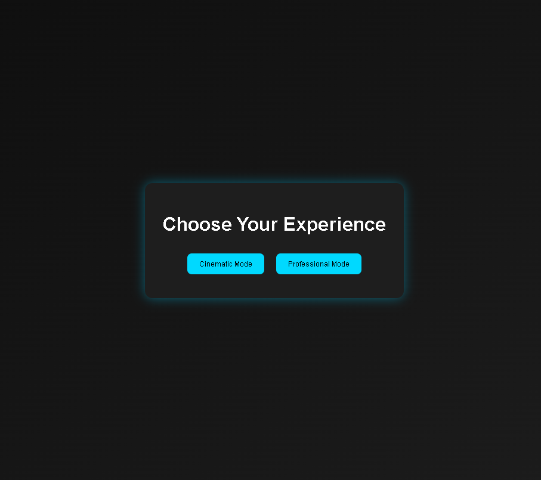
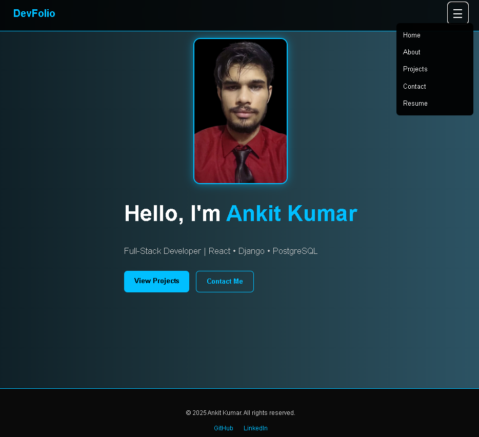

# 🧠 DevFolio — Ankit Kumar's Portfolio Website

> A modern, responsive, and animated portfolio built using **React + TypeScript**, with support for multiple modes: **Professional** and **Cinematic**.

---

## 🚀 Live Preview

🌐 **[View Portfolio on Vercel](https://your-vercel-link.vercel.app)**  
📁 Resume download link will be enabled after PDF upload

---

## 📸 Preview

> Cinematic Mode (Under Construction)  

> Professional Mode (About Section)  

---

## ✨ Features

- 🎬 **Cinematic Mode**  (Currently underconstruction)
  - Interactive “under construction” wall  
  - Cracked glowing light effects  
  - Animated Luffy running across the screen  

- 💼 **Professional Mode**  
  - Multi-page structure: Hero, About, Projects, Contact  
  - Animated page transitions  
  - Downloadable resume integration  

- 📱 **Fully Responsive** (Mobile, Tablet, Desktop)  
- ⚛️ Built with **React + TypeScript + Vite**  
- 🎨 Styled using **CSS Modules**  
- ⚡ Smooth animations using **Framer Motion**  
- 🧩 Clean folder structure, reusable components  
- 🌐 Deployed to **Vercel** *(also Netlify ready)*

---

## 🗂️ Folder Structure

src/
│
├── assets/ # All images (Luffy, icons, logos)
├── components/ # Navbar, Footer, Hero, ProjectCard, etc.
├── context/ # ModeContext (cinematic vs professional)
├── pages/ # About, Contact, ProjectsPage, Home
├── styles/ # Global + module CSS
├── App.tsx # Mode routing logic
└── main.tsx # React app root

---

## 🔧 Tech Stack

-----------------------------------------------------------
| Area         | Tools / Frameworks                       |
|--------------|------------------------------------------|
| Language     | TypeScript, JSX                          |
| Framework    | React + Vite                             |
| Styling      | CSS Modules                              |
| Animation    | Framer Motion                            |
| Icons        | React Icons                              |
| Deployment   | Vercelv, Netlify                         |
-----------------------------------------------------------

---

## 📄 Resume

📎 Resume download link is placed in the **About** section and Navbar.  
Once `Ankit-Kumar-Resume.pdf` is placed inside `/public/`, it will be active.

---

## 🙋‍♂️ Author

**Ankit Kumar**  
💼 GitHub: [@Anku-OO7](https://github.com/Anku-OO7)  
🌐 Portfolio: [your-vercel-link.vercel.app](https://your-vercel-link.vercel.app)

---

## 📝 License

This project is built for educational and professional purposes.  
All icons, branding, and images are either original or open-source.

---

> Built with ❤️, React ⚛️ and way too much coffee ☕  
